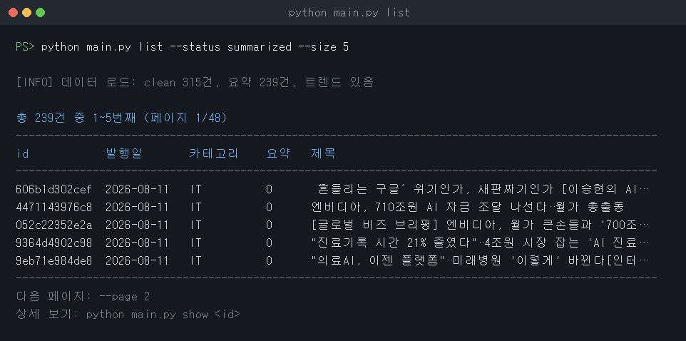
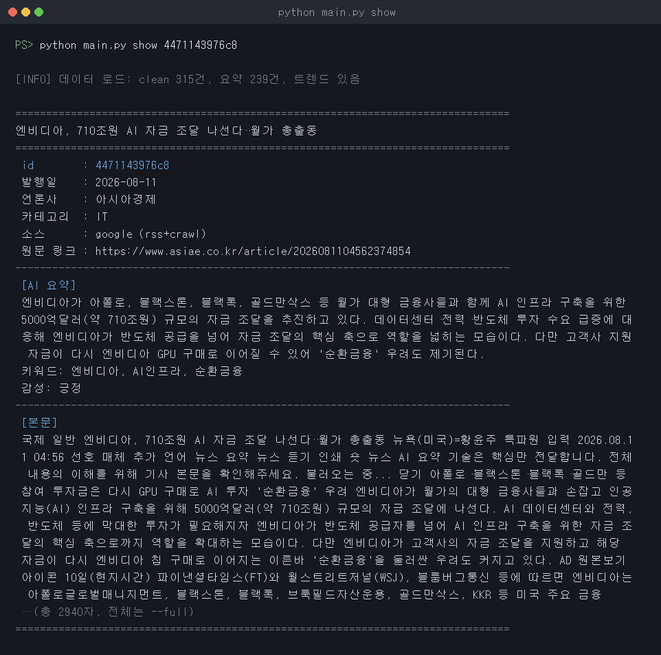

# AI News Trend Analysis

AI 뉴스 트렌드 분석 팀 프로젝트

**매일 그날 발행된 AI 뉴스만 모아 리포트로 만들어 이메일로 보냅니다.**
GitHub Actions 가 하루 한 번(23:00 KST) 수집 → 정제 → AI 요약·분석 → 리포트 → 메일까지 자동으로 돌립니다.
자세한 내용은 [정기 실행 스케줄링](#정기-실행-스케줄링-보너스) 을 보세요.

### 바로 돌려보기

```text
python main.py fetch --source google --limit 40   # 오늘(KST) 발행분만 수집
python main.py clean --today                      # 오늘치만 정제
python main.py summarize --today                  # 오늘치만 AI 요약 (OPENAI_API_KEY 필요)
python main.py analyze --today                    # 오늘치 트렌드 분석
python main.py report --today --format both       # 오늘치 리포트 + 차트
python main.py mail --attach-charts --require-today   # 메일 발송
```


## 프로젝트 구조

본 프로젝트는 기능별로 모듈을 분리하여 개발합니다.

```text
project/
│
├── main.py              # CLI 실행 (모든 서브커맨드 연결)
├── collector.py         # 뉴스 수집 (API/RSS, 크롤링)
├── cleaner.py           # 정제 핵심 로직 (필드 검증, 텍스트 정규화, 날짜 통일, 결측값 처리)
├── store.py             # raw 읽기 / clean 저장 / 중복 처리(skip·upsert)
├── clean_command.py     # clean 서브커맨드 진입점
├── log_setup.py         # 파이프라인 공통 로깅 설정
├── analyzer.py          # AI 뉴스 요약 / 감성 분석 / 트렌드 분석
├── analyze_command.py   # summarize / analyze 서브커맨드 진입점
├── reporter.py          # 집계·품질지표·리포트 문서 생성
├── visualizer.py        # matplotlib 차트 생성 (PNG)
├── exporter.py          # CSV / JSONL / Excel 내보내기
├── report_command.py    # report 서브커맨드 진입점
├── export_command.py    # export 서브커맨드 진입점
├── query_command.py     # list / show 조회 서브커맨드 (보너스)
│
├── data/
│   ├── raw/             # 수집한 원본 뉴스 데이터 (google/naver/govuk_news.jsonl)
│   ├── clean/           # 정제된 뉴스 데이터 (news_clean.jsonl)
│   └── analyzed/        # AI 요약·트렌드 분석 결과
│
├── output/
│   ├── reports/         # 실행 1회 = 폴더 1개
│   │   └── report_<날짜_시각>/
│   │       ├── report.md / report.txt
│   │       └── charts/  # 그 시점의 차트 PNG
│   └── exports/         # CSV / JSONL / Excel
├── logs/                # 실행 로그 (collector.log, pipeline.log)
│
├── .github/workflows/   # 정기 실행 자동화 (보너스)
│   ├── collect.yml      #   매일 - 수집 + 정제
│   └── analyze.yml      #   2026-08-14 1회 - 전체 파이프라인 (AI 분석·리포트 포함)
├── config.json          # 뉴스 소스, 정제 설정, 중복 처리 정책 등
├── requirements.txt     # Python 패키지 목록
└── README.md
```

### 팀 역할

| 파트 | 담당자 | 담당 기능 | 주요 파일 |
| --- | --- | --- | --- |
| 1. 뉴스 수집 | 박수진 | RSS / API / 웹 크롤링을 통한 AI 뉴스 수집 | `collector.py` |
| 2. 데이터 정제 | 강민주 | HTML 제거, 날짜 통일, 결측·중복 처리 | `cleaner.py`, `store.py`, `clean_command.py` |
| 3. AI 분석 | 김태희 | 뉴스 요약, 키워드 추출, 감성 분석, 트렌드 분석 | `analyzer.py`, `analyze_command.py` |
| 4. 시각화·리포트 | 전지영 | 차트 생성, 집계·리포트, CSV/Excel 내보내기 | `reporter.py`, `visualizer.py`, `exporter.py`, `report_command.py`, `export_command.py` |

공통 모듈은 `main.py`(CLI 연결), `log_setup.py`(로깅), `query_command.py`(보너스 조회 CLI)입니다.


## CLI 한눈에 보기

모든 기능은 `main.py` 의 서브커맨드로 실행합니다.

```text
python main.py fetch      --source google --limit 20     # 1. 뉴스 수집
python main.py clean      --policy skip                  # 2. 데이터 정제
python main.py summarize  --unsummarized                 # 3. AI 요약 + 감성 분석
python main.py analyze                                   # 3. AI 트렌드 분석
python main.py report     --format both                  # 4. 차트 + 리포트
python main.py export     --format excel                 # 4. 파일 내보내기
python main.py mail       --attach-charts                # 5. 리포트 이메일 발송

python main.py list --category IT --page 1               # (보너스) 목록 조회
python main.py show <뉴스 id>                             # (보너스) 상세 조회
```

각 커맨드의 옵션은 `python main.py <커맨드> --help` 로 확인할 수 있습니다.

### 날짜 옵션 (당일 뉴스만 다루기)

기준일은 언제나 **한국시간(KST)** 입니다. GitHub Actions 러너는 UTC 로 돌기 때문에
`datetime.now()` 를 그대로 쓰면 하루 전 날짜가 잡히므로, 날짜 계산은 모두 KST 로 맞춰 두었습니다.

| 커맨드 | 옵션 | 기본값 |
| --- | --- | --- |
| `fetch` | `--date YYYY-MM-DD` / `--all-dates` | **오늘(KST) 발행분만 수집** |
| `clean` | `--today`, `--date YYYY-MM-DD` | 전체 (raw 에 있는 것 모두) |
| `summarize` | `--today`, `--date YYYY-MM-DD` | 전체 (아직 요약 안 된 것 모두) |
| `analyze` | `--today`, `--date-from`, `--date-to` | 전체 |
| `report` | `--today`, `--date-from`, `--date-to`, `--articles N` | 전체 |
| `mail` | `--require-today` | 끔 |

- `fetch` 는 날짜 필터가 **기본값** 입니다. 이 프로젝트의 목적이 "당일 뉴스"이기 때문이며,
  과거 기사까지 모으려면 `--all-dates` 를 붙입니다.
- `--limit` 은 "날짜 필터를 통과한 기사 수"입니다. 하루치가 그보다 적으면 있는 만큼만 모읍니다.
- 날짜 판정은 **본문 크롤링 전에** 합니다. 뒤에서 거르면 버릴 기사까지 원문 페이지를 받아오게 됩니다.
- `mail --require-today` 는 가장 최근 리포트가 오늘 것이 아니면 발송을 중단합니다.
  `report` 단계가 실패했을 때 어제 리포트를 오늘 제목으로 다시 보내는 사고를 막습니다.


## 1. 뉴스 수집

collector.py에서 뉴스 데이터를 수집합니다.

현재 다음 세 가지 소스를 지원합니다.

### Google News
 - Google News RSS 사용
 - AI 관련 뉴스 수집
 - 수집 방법: rss+crawl

### NAVER News
 - NAVER 뉴스 검색 API 사용
 - 여러 AI 관련 검색어를 이용하여 뉴스 수집
 - 검색어:
            AI
            인공지능
            생성형 AI
            LLM
            AI 반도체
 - URL 기준 중복 뉴스 제거
 - API가 주는 description은 검색어 주변만 뽑은 스니펫이라 문장이 끊기는 경우가 많아,
   Google과 동일하게 기사 원문(`originallink`)을 크롤링해 본문을 채움
 - 크롤링이 차단되는 등 실패한 경우에만 API description으로 대체 (`content_source` 필드로 구분)
 - 수집 방법: api+crawl

### 본문 크롤링 공통 로직 (Google · NAVER)
 - 기사 원문 페이지에서 본문 영역(article, 본문 전용 class/id 등)을 우선 추출
 - 본문 영역을 찾지 못한 경우에만 메타 설명(`og:description` 등)으로 대체
   (메타 설명은 사이트가 미리 짧게 잘라둔 값이라 문장이 중간에 끊기는 경우가 많아 최후 수단으로만 사용)
 - 본문 길이는 최대 3000자로 제한 (초과 시 단어 단위로 끊어 "…" 표시, `content_truncated` 필드로 확인 가능)

### GOV.UK
 - BeautifulSoup을 이용한 웹 크롤링
 - AI 관련 뉴스 목록 수집
 - 각 기사 상세 페이지에 접근하여 본문 수집
 - 과도한 요청을 방지하기 위해 요청 간 지연 적용
 - 수집 방법: crawl

## 수집 데이터 구조

수집된 뉴스는 다음과 같은 공통 구조를 사용합니다.
```text
{
  "title": "뉴스 제목",
  "content": "뉴스 본문 (최대 3000자)",
  "url": "뉴스 URL",
  "published_at": "발행 시각",
  "source": "뉴스 소스",
  "collected_at": "수집 시각",
  "collection_method": "rss+crawl | api+crawl | crawl",
  "content_truncated": "본문이 3000자 상한으로 잘렸는지 여부",
  "content_max_length": "본문 길이 상한 (3000)"
}
```

- NAVER 뉴스의 경우 수집에 사용된 검색어를 확인할 수 있도록 `search_keyword` 필드가 추가됩니다.
- NAVER 뉴스는 크롤링 성공 여부를 나타내는 `content_source`(`crawl` | `api_description`) 필드와,
  원본 API 스니펫을 보관하는 `api_description` 필드가 추가됩니다.

## Raw 데이터 저장

수집된 원본 뉴스는 JSONL 형식으로 영구 저장합니다.

```text
data/raw/
├── google_news.jsonl
├── naver_news.jsonl
└── govuk_news.jsonl
```

 - JSONL은 한 줄에 하나의 뉴스 데이터를 저장합니다.

기존 데이터가 존재하는 경우 URL을 확인하여 이미 저장된 뉴스는 건너뛰고 새로운 뉴스만 추가합니다.

## HTTP 요청 및 오류 처리

외부 뉴스 소스 요청에는 timeout을 적용합니다.

HTTP 요청 과정에서 발생할 수 있는 다음 오류를 처리합니다.

 - 요청 시간 초과
 - HTTP 요청 실패
 - RSS / JSON 응답 파싱 오류
 - 기사 본문 수집 실패

GOV.UK 상세 기사 크롤링 시 요청 사이에 지연 시간을 적용하여 과도한 요청을 방지합니다.

## Logging

Python logging 모듈을 사용하여 프로그램 실행 상태를 기록합니다.

로그 레벨:

 - INFO: 정상적인 수집 및 저장 상태
 - WARNING: timeout 등 실행 가능한 예외 상황
 - ERROR: HTTP 요청 실패 등 수집 오류

로그는 터미널에 출력되는 동시에 다음 파일에도 누적 저장됩니다.
```text
logs/collector.log    # 1. 뉴스 수집 단계
logs/pipeline.log     # 2~4. 정제 / AI 분석 / 리포트 단계
```

## 설정 파일

공개 가능한 프로그램 설정은 config.json에서 관리합니다.

설정 항목:

 - 뉴스 소스 URL
 - NAVER 뉴스 검색 키워드
 - HTTP timeout
 - GOV.UK 요청 지연 시간
 - Raw 데이터 저장 경로
 - 중복 처리 정책

API 인증정보는 config.json에 저장하지 않습니다.

NAVER API 인증정보와 같은 비밀값은 .env 파일에서 관리하며 Git 저장소에 커밋하지 않습니다.

## 뉴스 수집 실행

```text
python main.py fetch --source google --limit 40          # 오늘(KST) 발행분
python main.py fetch --source naver  --limit 40
python main.py fetch --source govuk  --limit 20

python main.py fetch --source google --date 2026-08-26   # 특정 날짜만
python main.py fetch --source google --all-dates         # 날짜 필터 끄기
```

Google News RSS 는 검색어에 `when:1d` 를 붙여(`config.json` 의 `news_sources.google.url`)
최근 24시간 기사만 내려받습니다. 이게 없으면 피드 앞쪽이 옛날 기사로 채워져
당일 필터를 통과하는 기사가 몇 건 남지 않습니다.

## 2. 데이터 정제

cleaner.py / store.py / clean_command.py에서 raw 뉴스를 정제해 clean 저장소에 저장합니다.
자세한 내용은 [README_clean.md](README_clean.md) 참고.

정제 규칙:
 - 필수 필드 검증 (title, url, published_at)
 - 텍스트 정규화 (HTML 태그/엔티티 제거, 공백 정리)
 - 날짜 형식 통일 (한국시간 KST ISO)
 - 결측값 처리 (본문 없으면 제목으로 대체, 카테고리 기본값 적용)
 - 중복 처리 정책 적용 (skip / upsert)

실행:
```text
python main.py clean
python main.py clean --policy upsert
```

정제된 데이터는 raw와 분리된 `data/clean/news_clean.jsonl`에 저장됩니다.

## 3. AI 분석

정제된 뉴스를 AI로 요약하고, 그 요약들을 모아 트렌드를 분석하는 단계입니다.
`summarize`(기사 단위)와 `analyze`(전체 단위) 두 서브커맨드로 나뉩니다.

| 파일 | 역할 |
| --- | --- |
| `analyzer.py` | OpenAI 호출, 요약·감성·트렌드 분석 로직, 키워드·카테고리 집계 |
| `analyze_command.py` | `summarize` / `analyze` 서브커맨드 (옵션 처리 → analyzer 호출) |

사용 모델은 `config.json`의 `ai.model`에서 바꿀 수 있고(기본 `gpt-5.4`),
API 키는 `.env`의 `OPENAI_API_KEY`에서 읽습니다.

### 3-1. AI 요약

기사 본문을 3문장 이내로 요약하고 핵심 키워드 3개를 뽑습니다.

```text
python main.py summarize                     # 아직 요약되지 않은 뉴스 전체
python main.py summarize --unsummarized      # 위와 동일 (기본값을 명시)
python main.py summarize --all               # 전체 뉴스 대상 (이미 요약된 건은 스킵)
python main.py summarize --limit 20          # 최대 20건만
python main.py summarize --id 606b1d302cef   # 특정 뉴스 1건만
python main.py summarize --batch-size 3      # 한 번의 호출에 묶을 기사 수 (기본 5)
```

기사를 여러 건씩 묶어 한 번에 호출합니다. 호출 수가 줄어 비용과 시간이 함께 줄어듭니다.

이미 요약된 뉴스는 기본적으로 건너뜁니다. 결과를 한 줄씩 이어 붙이는(append) 방식이라
중간에 끊겨도 다시 실행하면 남은 건부터 이어서 처리합니다.

### 3-2. 감성 분석 (보너스)

각 뉴스의 논조를 **긍정 / 부정 / 중립** 중 하나로 분류합니다.
분류 기준은 프롬프트에 명시해 두었습니다.

- 긍정: 성장·성과·호재·기대를 다루는 기사
- 부정: 위기·규제·손실·우려를 다루는 기사
- 중립: 사실 전달 위주이거나 긍정·부정이 뚜렷하지 않은 기사

```text
python main.py summarize                     # 요약과 감성을 한 번에
python main.py summarize --sentiment-only    # 감성만 채우기
```

요약과 감성을 한 호출에서 함께 받기 때문에 평소에는 추가 비용이 없습니다.
`--sentiment-only`는 **이미 요약이 끝난 기사에 감성만 뒤늦게 채울 때** 쓰는 경로로,
본문 대신 제목과 요약만 보내므로 요약을 다시 돌리는 것보다 훨씬 쌉니다.

결과는 `news_summary.jsonl`의 `sentiment` 필드에 저장되고,
막대 차트(리포트 폴더 안 `charts/sentiment.png`)와 리포트의 "감성 분포" 표로 시각화됩니다.
내보내기(CSV/Excel)에도 `sentiment` 컬럼으로 포함됩니다.

### 3-3. 트렌드 분석

요약본 전체를 한 번에 넣고 주요 트렌드와 시사점을 뽑습니다.

```text
python main.py analyze                                   # 전체 기간·전체 카테고리
python main.py analyze --category IT                     # 특정 카테고리만
python main.py analyze --date-from 2026-08-01 --date-to 2026-08-11
```

키워드 빈도와 카테고리 분포는 **AI가 아니라 코드가 직접 집계**해서 프롬프트에 넣어 줍니다.
AI에게 숫자를 세게 하면 틀리기 때문에, 세는 일은 `Counter`가 하고 AI는 해석만 맡습니다.

> 조건을 걸고 실행해도 결과는 같은 `trend_report.json`에 저장되므로, 조건별로 돌린 뒤에는
> 마지막에 조건 없이 한 번 더 실행해 전체 기준 결과로 되돌려 놓아야 리포트가 어긋나지 않습니다.

### 3-4. 산출물

**`data/analyzed/news_summary.jsonl`** — 기사 1건당 1줄

| 필드 | 설명 |
| --- | --- |
| `id` | clean 데이터와 동일한 id (조인 키) |
| `title` / `category` / `source` / `published_date` | clean에서 그대로 가져온 메타 정보 |
| `summary` | 3문장 이내 요약 |
| `keywords` | 핵심 키워드 3개 |
| `sentiment` | 감성 (긍정 / 부정 / 중립) |

**`data/analyzed/trend_report.json`** — 전체 분석 결과 1개

| 필드 | 설명 |
| --- | --- |
| `trends` | 주요 트렌드 3~6개 (`title`, `description`) |
| `implications` | 시사점 3~5개 |
| `overall_summary` | 전체 흐름 3~4문장 요약 |
| `keyword_frequency` | 키워드 빈도 상위 15개 (`keyword`, `count`) |
| `category_distribution` | 카테고리별 건수 |
| `article_count` | 분석에 사용된 기사 수 |

### 3-5. 다른 파트와의 연결

- `news_summary.jsonl`의 `id`로 clean 데이터와 조인할 수 있습니다.
- 4번 파트(시각화·리포트)는 `trend_report.json`의 트렌드·시사점·종합 요약을
  그대로 가져다 씁니다.
- 다만 키워드 빈도와 카테고리 분포는 `reporter.py`가 `news_summary.jsonl`에서
  다시 집계합니다. `report --category IT` 처럼 조건을 걸었을 때 집계도 함께
  좁혀져야 하기 때문입니다. (`trend_report.json`의 통계는 `analyze` 실행 시점의
  전체 기준 값이라 필터를 따라가지 못합니다.)

### 3-6. 안정성 처리

- **응답 형식 고정** — structured outputs(strict)로 JSON 스키마를 API 쪽에서 강제합니다.
  모델이 형식을 어기거나 코드펜스를 붙일 수 없어 파싱이 실패하지 않습니다.
- **호출 한도·서버 오류** — 429나 5xx는 SDK가 지수 백오프로 자동 재시도합니다(최대 5회).
- **실패 시 스킵** — 재시도로도 실패한 배치는 `logs/pipeline.log`에 ERROR로 남기고
  다음 배치로 넘어갑니다. 한 배치가 실패해도 전체가 멈추지 않습니다.
- **잘림·거부 감지** — 응답이 토큰 한도에서 잘리거나 안전 정책으로 거부되면
  정상 응답으로 착각하지 않도록 따로 확인합니다.

## 4. 시각화 및 리포트 생성

정제·분석까지 끝난 데이터를 사람이 읽는 결과물로 바꾸는 단계입니다.
모듈은 역할별로 나눠 두었습니다.

| 파일 | 역할 |
| --- | --- |
| `reporter.py` | 데이터 로드, 품질 지표·TOP N 집계, 리포트 문서(Markdown/TXT) 작성 |
| `visualizer.py` | matplotlib 차트 생성 (PNG) |
| `exporter.py` | CSV / JSONL / Excel 내보내기 |
| `report_command.py` | `report` 서브커맨드 (집계 → 차트 → 리포트) |
| `export_command.py` | `export` 서브커맨드 (필터 → 파일 저장) |

집계(`reporter`)와 그리기(`visualizer`)를 나눈 이유는, 집계 기준을 바꿔도
차트 코드를 건드릴 필요가 없게 하기 위해서입니다.

### 4-1. 리포트 실행

```text
python main.py report                                  # 차트 + 리포트(MD) 생성
python main.py report --format both                    # MD와 TXT 동시 저장
python main.py report --category IT --top 15           # IT 카테고리만, TOP 15
python main.py report --date-from 2026-08-01 --date-to 2026-08-09
python main.py report --no-charts                      # 집계·리포트만 (차트 생략)
python main.py report --date-field collected           # 수집일 기준 추이로 전환
```

주요 옵션

| 옵션 | 설명 |
| --- | --- |
| `--category` | 특정 카테고리만 집계 |
| `--date-from` / `--date-to` | 기간 지정 (YYYY-MM-DD, 양끝 포함) |
| `--top` | TOP N 집계 개수 (기본 10) |
| `--format` | `md` / `txt` / `both` (기본 md) |
| `--date-field` | 추이 기준 날짜 — `published`(발행일, 기본) / `collected`(수집일) |
| `--no-charts` | 차트 생성 생략 |
| `--quiet` | 콘솔 요약 출력 생략 |

기간·카테고리 필터를 걸면 요약 데이터도 같은 조건으로 좁혀서 집계하기 때문에,
키워드 TOP N이 필터 범위 밖의 기사까지 세는 문제가 생기지 않습니다.

### 4-2. 차트

차트는 **그 실행의 리포트 폴더 안**에 저장됩니다.

```text
output/reports/report_20260811_163556/
├── report.md
├── report.txt
└── charts/
    ├── category_counts.png
    ├── daily_trend.png
    ├── top_keywords.png
    ├── source_share.png
    └── sentiment.png
```

차트를 `output/charts/` 한 곳에 고정 이름으로 두면 실행할 때마다 덮어써져,
**과거 리포트가 최신 차트를 가리키는 문제**가 생깁니다(본문은 203건인데 차트는 239건).
리포트가 자기 차트를 갖고 다니게 해서 시점별로 일관되게 남도록 했습니다.

| 파일 | 내용 |
| --- | --- |
| `category_counts.png` | 카테고리별 뉴스 수 (막대) |
| `daily_trend.png` | 일자별 수집 추이 (꺾은선, 최다일 표시) |
| `top_keywords.png` | AI가 뽑은 키워드 TOP N (가로 막대) |
| `source_share.png` | 소스별 수집 비중 (원 그래프) |
| `sentiment.png` | 뉴스 감성 분포 (가로 막대, 보너스) |

`sentiment.png` 는 감성 분석이 끝난 기사가 있을 때만 생성됩니다.

한글 폰트는 실행 환경에 설치된 것을 자동으로 찾아 적용합니다.
(macOS `AppleGothic` → Windows `Malgun Gothic` → 리눅스 `NanumGothic` 순으로 탐색)
찾지 못하면 경고 로그를 남기고, 차트의 한글이 네모(□)로 보일 수 있습니다.
리눅스에서는 `sudo apt install fonts-nanum` 으로 설치할 수 있습니다.

화면이 없는 환경(GitHub Actions 등)에서도 동작하도록 matplotlib 백엔드는
파일 저장 전용(`Agg`)으로 고정했습니다.

### 4-3. 리포트 구성

실행 한 번이 폴더 하나가 됩니다. `output/reports/report_<날짜_시각>/` 안에
`report.md`(또는 `report.txt`)와 `charts/` 가 함께 저장되고, 실행 시 콘솔에도 요약이 출력됩니다.

0. **뉴스 목록** — 제목·링크·언론사·발행 시각, 요약이 있으면 요약 한 줄.
   메일로 받는 쪽이 가장 먼저 보는 부분이라 맨 앞에 둡니다.
   개수는 `--articles N`(0 이면 전부) 또는 `config.json` 의 `report.article_limit` 으로 조절합니다.
1. **데이터 품질 지표** (각 지표의 의미를 표에 함께 표기)
   - 요약 완료율 — 전체 뉴스 중 AI 요약이 끝난 비율
   - 본문 확보율 — 본문이 300자 이상 확보된 비율. 미만은 크롤링이 본문 영역을
     찾지 못해 메타 설명(150~200자)으로 대체된 경우
   - 평균 본문 길이
   - 본문 잘림 비율 — 3000자 상한에 걸려 뒷부분이 잘린 비율. 잘린 기사는
     AI가 원문 일부만 보고 요약하게 되므로 요약 신뢰도 판단에 쓴다
2. **수집 분포** — 카테고리별 / 소스별 건수, **수집 방식별 비교**, 일자별 추이 요약
   - 수집 방식별 비교는 `rss+crawl` / `api+crawl` / `crawl` 각각의 건수·평균 본문
     길이·본문 확보율을 나란히 보여준다. API·RSS 방식과 크롤링 방식의 장단점을
     숫자로 확인할 수 있다
3. **TOP N 집계** — AI가 추출한 키워드 TOP N
4. **AI 인사이트** — 감성 분포(긍정/중립/부정) 표와,
   `data/analyzed/trend_report.json` 의 주요 트렌드·시사점·종합 요약
5. **차트** — 생성된 PNG를 리포트 기준 상대경로로 첨부 (MD 뷰어에서 바로 보입니다)

AI 분석 결과가 아직 없으면 4번 항목 자리에 안내 문구가 들어가고,
나머지 집계는 그대로 생성됩니다.

**모집단 표기**: 항목마다 세는 대상이 다릅니다. 품질 지표와 수집 분포는 정제 완료
전체를, 키워드·감성·AI 인사이트는 요약이 끝난 기사만을 셉니다(키워드와 감성은
AI가 만드는 값이라 요약 전 기사에는 존재하지 않습니다). 각 항목 제목과 차트
우측 하단에 기준 건수를 적어 두어, 차트만 따로 떼어 봐도 오해가 없게 했습니다.

AI 인사이트는 `analyze` 를 실행한 시점의 요약본을 기준으로 작성된 글이라,
그 뒤에 뉴스가 더 쌓이거나 필터를 걸면 리포트의 다른 집계와 기준이 어긋납니다.
본문에 건수가 직접 인용되는 경우가 있어, 이때는 4장 상단에 경고 문구가 표시됩니다.

### 4-4. 데이터 내보내기

`output/exports/` 에 저장됩니다. clean 뉴스와 AI 요약을 뉴스 id 기준으로 합쳐,
한 줄에 기사 정보와 요약·키워드·감성이 모두 담기게 만듭니다.
아직 요약되지 않은 기사는 요약·키워드·감성 칸이 비고 `status` 가 `unsummarized` 로 표시됩니다.

```text
python main.py export --format csv                     # CSV
python main.py export --format excel                   # Excel(.xlsx)
python main.py export --format jsonl                   # JSONL
python main.py export --format all                     # 세 포맷 모두
python main.py export --status summarized              # 요약 완료 건만
python main.py export --category IT --limit 50 --filename it_top50.csv
```

| 옵션 | 설명 |
| --- | --- |
| `--format` | `csv` / `jsonl` / `excel` / `all` |
| `--status` | `all`(기본) / `summarized` / `unsummarized` |
| `--category`, `--date-from`, `--date-to` | 조건 필터 |
| `--limit` | 최신순 최대 건수 |
| `--filename` | 저장 파일명 지정 |

- CSV는 `utf-8-sig`(BOM 포함)로 저장합니다. 그래야 윈도우 엑셀에서 열었을 때 한글이 깨지지 않습니다.
- Excel은 헤더 고정·열 필터가 적용된 `뉴스` 시트와, 품질 지표·카테고리·키워드가 담긴 `요약 통계` 시트로 구성됩니다.
- 파일명에 날짜시각(초 단위)이 붙어 이전 결과를 덮어쓰지 않습니다.

### 4-5. 뉴스 조회 (보너스)

```text
python main.py list                                    # 최신순 목록 (기본 20건)
python main.py list --category IT --keyword 반도체      # 조건 검색
python main.py list --status unsummarized --page 2     # 페이지 이동
python main.py show 613de6543210                       # 상세 조회
python main.py show 613de6543210 --full                # 본문 전체 보기
```

`list` 는 카테고리·기간·검색어·요약 상태 필터와 페이지네이션(`--page`, `--size`)을 지원하고,
`show` 는 기사 메타 정보 + AI 요약 + 키워드 + 감성 + 본문을 함께 보여줍니다.

**실행 화면**

`list` — 요약이 끝난 기사만 좁혀서 조회한 결과입니다. `요약` 칸의 `O` 로 요약 여부를 구분하고,
하단에 다음 페이지와 상세 조회 방법을 안내합니다.



`show` — 기사 하나의 메타 정보와 AI 요약·키워드·감성을 함께 보여줍니다.
본문은 길이가 길어 앞부분만 출력하고, 전체는 `--full` 로 볼 수 있습니다.



## 전체 파이프라인

각 단계는 앞 단계의 결과 파일을 입력으로 받습니다. 순서대로 실행하면 됩니다.

```text
python main.py fetch --source google --limit 40   # 수집  → data/raw/*.jsonl
python main.py clean --today                      # 정제  → data/clean/news_clean.jsonl
python main.py summarize --today                  # 요약  → data/analyzed/news_summary.jsonl
python main.py analyze --today                    # 분석  → data/analyzed/trend_report.json
python main.py report --today --format both       # 리포트 → output/reports/report_<날짜_시각>/
python main.py mail --attach-charts --require-today   # 메일 발송
python main.py export --format all                # 내보내기 → output/exports
```

`--today` 계열 옵션을 빼면 지금까지 쌓인 전체 데이터를 대상으로 동작합니다.
`data/clean/news_clean.jsonl` 은 계속 누적되는 보관용이라, 날짜를 좁히지 않으면
리포트가 몇 달치를 한꺼번에 집계합니다.

```text
뉴스 수집
   ↓
Raw JSONL 저장
   ↓
데이터 정제 (clean JSONL)
   ↓
AI 요약 / 키워드 추출
   ↓
AI 트렌드 분석
   ↓
통계 집계 + 차트 + 리포트 + 내보내기
```


### 실행 준비

Python 3.10 이상이 필요합니다.

```text
python -m venv .venv
source .venv/bin/activate      # Windows: .venv\Scripts\activate
pip install -r requirements.txt
```

차트·엑셀 기능에는 `matplotlib`, `openpyxl` 이 필요하며 requirements.txt에 포함돼 있습니다.

### 환경변수

.env 예시:
```text

NAVER_CLIENT_ID=your_client_id
NAVER_CLIENT_SECRET=your_client_secret
OPENAI_API_KEY=your_openai_api_key
GMAIL_ADDRESS=you@gmail.com
GMAIL_APP_PASSWORD=abcdefghijklmnop
```

- `NAVER_*` : NAVER 뉴스 검색 API (수집 단계)
- `OPENAI_API_KEY` : OpenAI API (AI 요약·분석 단계)
- `GMAIL_*` : 리포트 메일 발송 (`mail` 커맨드).
  `GMAIL_APP_PASSWORD` 는 계정 비밀번호가 아니라 Google 계정 → 보안 → 2단계 인증 →
  앱 비밀번호에서 발급하는 **16자리** 값입니다.

수집·요약 단계가 없어도 메일 단계는 `GMAIL_*` 만 있으면 동작합니다.

AI 모델은 `config.json` 의 `ai.model` 에서 바꿀 수 있습니다.

실제 API 키가 포함된 .env 파일은 GitHub에 업로드하지 않습니다

## 정기 실행 스케줄링 (보너스)

> **보너스 과제**: "cron 또는 작업 스케줄러를 이용한 정기 수집 방법을 README.md에 문서화한다."
> 본 저장소는 문서화에 그치지 않고 **GitHub Actions로 실제 자동화까지 적용**했습니다.

파이프라인은 목적이 다른 세 워크플로로 나눠 두었습니다.

| 워크플로 | 주기 | 하는 일 |
| --- | --- | --- |
| `daily_report.yml` | **매일 23:00 KST** | 당일 수집 → 정제 → AI 요약·분석 → 리포트 → **이메일 발송** |
| `collect.yml` | 수동 실행만 | 수집 → 정제 (수집 단계만 따로 확인할 때) |
| `analyze.yml` | 2026-08-14 1회 (종료) | 과제 제출용 전체 실행. 이후에는 수동 실행만 |

`collect.yml` 의 예약 실행은 꺼 두었습니다. `daily_report.yml` 이 수집부터 메일까지 한 번에
돌리는데 둘 다 매일 돌면 같은 파일을 두 번 커밋해 push 가 서로 밀어내기 때문입니다.

### 방법 1. GitHub Actions (본 저장소에 적용됨)

PC를 켜두지 않아도 GitHub의 클라우드 러너가 정해진 시각에 자동 실행하고, 결과를 저장소에 커밋합니다.

**일일 뉴스 메일 — `.github/workflows/daily_report.yml`**

- 스케줄: 매일 23:00 KST (cron `0 14 * * *`, UTC 기준)
- 동작: 당일 발행분 수집(3소스) → 정제 → AI 요약·감성 → 트렌드 분석 → 리포트·차트 → 이메일 발송 → 커밋·푸시
- 기준일은 첫 스텝에서 `TZ=Asia/Seoul date +%F` 로 한 번 정해 모든 단계에 넘깁니다.
  실행 도중 자정을 넘겨도 단계마다 날짜가 어긋나지 않습니다.
- `Run workflow` 로 수동 실행할 때는 `date` 입력에 `2026-08-26` 처럼 적어 특정 날짜를 다시 만들 수 있습니다.

**왜 아침이 아니라 밤 23시인가** — 아침 7시에 돌리면 "그날 발행분"이 00~07시 기사밖에 없어
하루치라고 부르기 어렵습니다. 하루가 끝날 무렵 돌려야 온전한 당일치가 됩니다.
아침에 받고 싶다면 cron 을 `0 22 * * *`(07:00 KST)로 바꾸고, 워크플로의 기준일 스텝에서
`date +%F` 를 `date -d yesterday +%F` 로 바꿔 **전일치**를 보내면 됩니다.

**AI 단계가 없어도 메일은 나갑니다** — 필수 secret 은 메일 계정 두 개뿐입니다.
`OPENAI_API_KEY` 가 없으면 요약·트렌드 분석 단계만 건너뛰고(경고 표시) 기사 목록과 통계는
그대로 발송됩니다. NAVER 키가 없으면 네이버 수집만 빠집니다.

**필요한 Secrets** — 저장소 Settings → Secrets and variables → Actions에 등록합니다.

| 이름 | 필수 | 쓰이는 곳 |
| --- | --- | --- |
| `GMAIL_ADDRESS` | **예** | 발신 Gmail 주소 |
| `GMAIL_APP_PASSWORD` | **예** | Gmail **앱 비밀번호 16자리** (계정 비밀번호가 아닙니다) |
| `OPENAI_API_KEY` | 아니오 | AI 요약·감성·트렌드 분석 |
| `NAVER_CLIENT_ID` | 아니오 | NAVER 뉴스 수집 |
| `NAVER_CLIENT_SECRET` | 아니오 | NAVER 뉴스 수집 |

앱 비밀번호는 Google 계정 → 보안 → 2단계 인증 → 앱 비밀번호에서 발급합니다.
수신자를 발신 계정과 다르게 하려면 `config.json` 의 `email.to` 에 적거나 `--to` 옵션을 씁니다.

**전체 파이프라인(과제 제출본) — `.github/workflows/analyze.yml`**

- 스케줄: **2026-08-14 06:30 KST 딱 한 번** (cron `30 21 13 8 *`, UTC 기준 — 13일 21:30 UTC가 14일 06:30 KST)
- cron에는 연도 필드가 없어 날짜만으로는 매년 반복됩니다. 그래서 `guard` 잡에서 실행일이
  2026-08-14(KST)인지 확인하고, 아니면 본 작업을 건너뜁니다. 수동 실행은 날짜와 무관하게 항상 동작합니다.
- `output/exports/`는 `.gitignore` 대상이라 커밋되지 않으므로, 워크플로 아티팩트로 업로드해 30일간 내려받을 수 있게 했습니다.

**저장소에 커밋되는 것** — 수집·정제·요약 데이터와 `report.md` / `report.txt` 입니다.
차트 PNG 는 매일 5장씩 쌓이면 저장소가 계속 커지므로 `.gitignore` 로 제외했고,
메일 첨부(`--attach-charts`)와 워크플로 아티팩트로 받습니다.

cron 표현식은 `분 시 일 월 요일` 순서입니다. `0 14 * * *`는 "매일 UTC 14시 정각"을 뜻합니다.

> **GitHub Actions의 cron은 UTC 기준입니다.** 한국시간에서 9시간을 빼야 합니다.
> 23:00 KST는 같은 날 14:00 UTC지만, 06:30 KST는 **전날** 21:30 UTC가 되어 날짜가 하루 당겨집니다.
> 그래서 "8월 14일 06:30 KST"는 `14 8 *` 가 아니라 `13 8 *` 로 적어야 합니다.

> **cron에는 연도 필드가 없습니다.** `분 시 일 월 요일` 다섯 자리가 전부라 "2026년에만"을
> 표현할 방법이 없고, `30 21 13 8 *`는 매년 8월에 다시 걸립니다. 그래서 워크플로 첫 잡에서
> 실행일이 2026-08-14(KST)인지 확인하고 아니면 건너뛰도록 해, 실질적으로 한 번만 실행되게 했습니다.

### 방법 2. Linux / macOS - cron

터미널에서 `crontab -e` 실행 후 아래와 같이 등록합니다.

```text
0 23 * * * cd /path/to/project && ./daily.sh >> logs/cron.log 2>&1
```

`daily.sh` 는 하루치 파이프라인을 순서대로 실행합니다.

```bash
#!/usr/bin/env bash
set -e
python main.py fetch --source google --limit 40
python main.py fetch --source naver  --limit 40
python main.py fetch --source govuk  --limit 20
python main.py clean --policy upsert --today
python main.py summarize --today || true   # AI 단계가 실패해도 메일은 보낸다
python main.py analyze --today || true
python main.py report --today --format both
python main.py mail --attach-charts --require-today
```

위 예시는 매일 23:00에 그날 발행분을 모아 메일까지 보내도록 등록한 것입니다.
수집만 하고 싶다면 `fetch` 세 줄만 등록해도 됩니다.

### 방법 3. Windows - 작업 스케줄러(Task Scheduler)

1. `Win + R` → `taskschd.msc` 실행
2. "작업 만들기" 선택 후 트리거를 "매일 06:00"으로 설정
3. 동작으로 "프로그램 시작"을 선택하고 아래와 같이 입력
   - 프로그램/스크립트: `cmd`
   - 인수 추가: `/c daily.bat`
   - 시작 위치: 프로젝트 루트 폴더 경로

`daily.bat` 에 위 cron 예시와 같은 순서(fetch → clean → summarize → analyze → report → mail)를 적습니다.

또는 PowerShell에서 `schtasks` 명령으로 등록할 수 있습니다.

```powershell
schtasks /create /tn "AI뉴스일일리포트" /tr "cmd /c C:\path\to\project\daily.bat" /sc daily /st 23:00
```


## 프로젝트를 마치며

### 과제 목표 점검

과제가 제시한 다섯 가지 학습 목표를, 이 프로젝트에서 실제로 마주친 근거와 함께 정리했습니다.

#### 1. API/RSS 방식과 크롤링 방식의 장단점

세 소스를 모두 구현해 본 결과, **본문 확보의 관점에서 뚜렷한 차이**가 있었습니다.

> 아래 수치는 **2026-08-11 16:37 생성 리포트 기준**입니다.
> (대상 기간 발행일 2026-04-28 ~ 2026-08-11, 정제 완료 239건 · AI 요약 완료 239건)
> 이후로도 매일 수집이 이어지므로 건수는 계속 늘어납니다. 최신 수치는 `python main.py report` 로 다시 뽑을 수 있습니다.

| 방식 | 소스 | 건수 | 평균 본문 | 본문 확보율 |
| --- | --- | ---: | ---: | ---: |
| `api+crawl` | NAVER | 117건 | 1,714자 | 84.6% |
| `rss+crawl` | Google | 102건 | 1,774자 | 80.4% |
| `crawl` | GOV.UK | 20건 | 2,996자 | **100.0%** |

- **API/RSS는 목록을 얻기 쉽습니다.** 규격이 정해져 있어 파싱이 안정적이고, 차단될 걱정도 없습니다.
  하지만 **본문을 주지 않습니다.** NAVER API의 `description`은 검색어 주변만 잘라낸 스니펫이라
  문장이 중간에서 끊기고, Google RSS도 제목과 링크가 전부입니다.
  그래서 두 방식 모두 결국 원문을 다시 크롤링해야 했고, 그래서 방식 이름이 `api+crawl`, `rss+crawl` 입니다.
- **크롤링은 본문을 온전히 가져옵니다.** GOV.UK만 본문 확보율 100%에 평균 길이도 1.7배입니다.
  대신 사이트 구조가 바뀌면 깨지고, 요청 간 지연을 넣어야 해서 느립니다(20건 수집에 가장 오래 걸립니다).
- **결론: 목록은 API/RSS로, 본문은 크롤링으로.** 한쪽만으로는 부족했습니다.

#### 2. 외부 API 수집과 오류 상황 처리

네트워크 작업은 실패를 전제로 짜야 한다는 것을 반복해서 확인했습니다.

- **타임아웃**은 모든 요청에 걸었습니다(`config.json`의 `request.timeout`). 없으면 응답이 없는 서버에 무한정 매달립니다.
- **실패 지점마다 다르게 대응**했습니다. 타임아웃·HTTP 실패·파싱 오류·본문 수집 실패를 각각 잡아,
  본문을 못 가져오면 메타 설명으로 대체하는 식으로 부분 실패를 허용했습니다.
- **한 건의 실패가 전체를 멈추지 않게** 했습니다. AI 요약도 배치 하나가 실패하면 로그에 남기고 다음으로 넘어갑니다.
- **요청 간 지연**을 넣어 상대 서버에 부담을 주지 않도록 했습니다.

#### 3. raw / clean 분리 저장의 이유

처음에는 한 번에 정제해서 저장하면 될 것 같았지만, 나눠 두길 잘했다고 느낀 순간이 있었습니다.

- **정제 규칙을 고칠 때마다 다시 수집할 필요가 없습니다.** raw가 남아 있으니 `clean`만 다시 돌리면 됩니다.
  실제로 카테고리 분류나 날짜 파싱을 여러 번 손봤는데, 그때마다 재수집했다면 시간도 오래 걸리고
  뉴스 목록이 이미 바뀌어 있어 같은 데이터로 비교할 수도 없었을 겁니다.
- **원본이 남아 있어 문제를 추적할 수 있습니다.** clean 데이터가 이상하면 raw와 대조해
  수집이 잘못된 건지 정제가 잘못된 건지 구분할 수 있습니다.
- 그래서 `data/`를 raw → clean → analyzed 세 단계로 나눴고, 각 단계는 앞 단계를 읽기만 합니다.

#### 4. AI API로 요약·분석하는 흐름

단순히 "호출해서 받는" 것보다, **비용과 실패를 어떻게 다루느냐**가 실제 작업의 대부분이었습니다.

- **여러 건을 묶어 한 번에 호출**합니다. 기사 5건을 한 요청에 담으면 호출 수가 1/5로 줄어
  비용과 시간이 함께 줄어듭니다.
- **응답 형식을 API 쪽에서 강제**합니다(structured outputs). 처음에는 모델이 붙이는 ` ```json ` 코드펜스를
  문자열로 잘라냈는데, 형식이 조금만 달라도 깨졌습니다. JSON 스키마를 지정하니 파싱 실패 자체가 사라졌습니다.
- **이어하기가 가능하게** 했습니다. 결과를 한 줄씩 이어 붙이는 방식이라 중간에 끊겨도
  다시 실행하면 남은 것부터 처리합니다. 239건을 한 번에 돌릴 때 이 구조가 없었다면 불안했을 겁니다.
- **숫자는 AI에게 맡기지 않았습니다.** 키워드 빈도와 카테고리 분포는 코드가 `Counter`로 세어
  프롬프트에 넣어 주고, AI는 그 숫자를 해석만 합니다. 세는 일을 맡기면 틀립니다.

#### 5. 데이터 집계와 matplotlib 시각화

- **집계와 그리기를 분리**했습니다(`reporter.py` / `visualizer.py`). 집계 기준을 바꿔도 차트 코드를 건드릴 필요가 없습니다.
- **환경에 따라 한글이 깨집니다.** 로컬(Windows)에서는 잘 나오던 차트가 GitHub Actions(Ubuntu)에서는
  전부 네모(□)로 나왔습니다. matplotlib은 시스템에 설치된 폰트만 쓰기 때문입니다.
  워크플로에 폰트 설치를 넣어 해결했습니다.
- **차트도 데이터와 함께 버전을 맞춰야 합니다.** 차트 파일명을 고정해 두었더니 리포트를 새로 만들 때마다
  과거 리포트의 차트까지 바뀌어, 본문은 203건인데 차트는 239건을 보여주는 일이 생겼습니다.
  리포트를 실행별 폴더로 묶어 자기 차트를 갖고 다니게 해서 해결했습니다.

### 팀원 회고

**박수진 (1. 뉴스 수집)**
프로젝트의 첫 단계인 뉴스 수집을 맡아 Google News(RSS), NAVER 검색 API, GOV.UK(웹 크롤링) 세 소스를 `collector.py`에 구현했습니다. 소스마다 다른 응답을 공통 스키마로 맞추고 URL 기준으로 중복을 걸렀으며, 타임아웃·HTTP 실패·파싱 오류를 나눠 처리했습니다. 가장 오래 붙잡은 건 본문이었습니다. RSS·API가 주는 요약을 그대로 본문에 넣었더니 Google은 제목만 반복하고 NAVER는 검색어 주변만 자른 스니펫이라 문장이 끊겼는데, 건수만 보면 멀쩡해 보여 한동안 알아채지 못했습니다. 원문을 직접 크롤링하도록 바꾸면서 메타 설명보다 본문 영역을 먼저 찾도록 순서를 뒤집고, 180자였던 길이 제한도 3000자로 올렸습니다. 이미 모아둔 기사는 RSS를 다시 조회하면 목록이 바뀌어 유실되므로 저장해 둔 URL로 직접 재크롤링했습니다.

이전 팀 프로젝트에서 RSS 수집을 어렵지 않게 끝냈던 터라 이번에도 쉽게 보고 빠르게 끝내는 데만 신경 썼던 것이 불찰이었습니다. 제 결과물 위에서 뒷 파트가 진행되는 만큼 본문이 제대로 들어오는지, 나중에 날짜별 분포를 그리려면 매일 꾸준히 쌓아 두어야 한다는 것까지 먼저 챙겼어야 했는데 수집량이 방대하다 보니 잘 됐겠거니 하고 넘어갔습니다. 그 탓에 제가 코드를 고치는 동안 다음 파트 팀원이 기다려야 했고, 이 점을 많이 반성했습니다. 내 손을 떠난 결과물이 곧 다른 사람의 입력이 된다는 것, 이것이 개인 과제와 팀 과제의 가장 큰 차이였습니다. 이번에 부족했던 부분을 보완해 다음 과제에서는 더 나은 협업을 하고 싶습니다.

**강민주 (2. 데이터 정제)**
수집된 원본 뉴스(google / naver / gov.uk)를 분석하기 좋은 형태로 정제하는 clean 파트를 맡았습니다. HTML·특수문자 제거, 제목에서 언론사명 분리, 소스마다 다른 날짜 형식의 한국시간 통일, 본문 길이 상한 처리, 중복 제거(url·제목 기준)를 구현했고, 결과를 clean 저장소(JSONL)에 저장했습니다. 코드는 cleaner.py, store.py, clean_command.py, log_setup.py로 모듈을 분리했습니다.

실제 데이터를 돌려보기 전엔 문제를 알 수 없다는 걸 체감했습니다. 소스마다 날짜 형식이 달라 gov.uk 기사 20건이 통째로 버려지던 걸 직접 확인하고 고쳤고, 정제 과정에서 발견한 데이터 특성(구글 본문 부재, 카테고리·날짜 편중)을 팀에 공유해 수집·시각화에 반영되도록 했습니다. 비전공자로서 Git이 처음이라 브랜치·PR 과정이 낯설었지만 한 단계씩 익혔고, config는 수집 담당과 겹치는 파일이라 임의로 수정하지 않고 코드만 올려 충돌을 방지했습니다.

**김태희 (3. AI 분석)**
정리된 뉴스 93건을 AI API로 요약하고, 이를 바탕으로 트렌드·키워드·시사점을 분석하는 AI 분석 파트를 맡았습니다. Gemini API로 analyzer.py를 구현해 기사 단위 요약, 5건씩 묶는 배치 처리, 무료 티어 일일 한도 초과 시 여러 모델로 자동 전환하는 로직을 구성했습니다. 키워드 빈도와 카테고리 분포는 Python으로 직접 집계한 실제 수치를 프롬프트에 근거로 제공하고, 이를 바탕으로 AI가 트렌드와 시사점을 작성하도록 설계해 숫자가 임의로 추정되지 않도록 했습니다. 결과는 news_summary.jsonl(기사별 요약), trend_report.json(종합 분석)으로 저장했고, Git 저장소에도 반영했습니다.

무료 API 한도라는 제약을 실제로 겪으면서, 처음 설계대로 흘러가지 않을 때 배치 크기 조정이나 모델 전환 같은 대안을 마련하는 과정이 필요하다는 걸 체감했습니다. Git 연동 작업 중에는 로컬 작업 폴더가 초기화되면서 결과 파일이 사라지는 상황도 겪었는데, 다행히 이전 백업으로 복구할 수 있었지만 작업 폴더 관리의 중요성을 다시 느꼈습니다. 이후 팀원이 Gemini 한도 문제로 OpenAI로 제공자를 교체했는데, 제가 겪었던 문제의 연장선이라 이해되는 결정이었습니다. 

**전지영 (4. 시각화·리포트)**
정제·분석이 끝난 데이터를 사람이 읽는 결과물로 바꾸는 파트를 맡았습니다. matplotlib으로 카테고리별·일자별 추이·키워드 TOP N·소스별 비중 차트를 그리고, 품질 지표와 TOP N 집계에 AI 인사이트를 합친 리포트를 콘솔과 MD/TXT로 냈습니다. CSV·JSONL·Excel 내보내기와 보너스인 조회 커맨드(list/show)도 구현했고, 요구사항상 필수인 서브커맨드 6종을 main.py에 연결했습니다. 코드는 집계(reporter.py)·그리기(visualizer.py)·내보내기(exporter.py)로 나눠, 집계 기준을 바꿔도 차트 코드를 건드릴 필요가 없게 했습니다.

가장 오래 고민한 건 "이 숫자는 무엇을 센 것인가"였습니다. 카테고리·소스는 정제된 뉴스 전체를 세지만 키워드는 요약이 끝난 기사에만 존재하는데, 기준을 하나로 통일하면 "아직 다 요약되지 않았다"는 사실이 리포트에서 사라집니다. 그래서 통일하는 대신 항목마다 기준 건수를 제목과 차트에 적어 두는 쪽을 택했고, 나중에 추가된 감성 분포도 같은 방식으로 붙었습니다. 반대로 macOS에서만 확인하다 Windows에서 차트 경로가 깨지는 문제를 놓쳤는데, 보여주는 쪽 작업일수록 다른 환경에서 한 번 더 확인해야 한다는 걸 팀원 덕분에 알았습니다.
